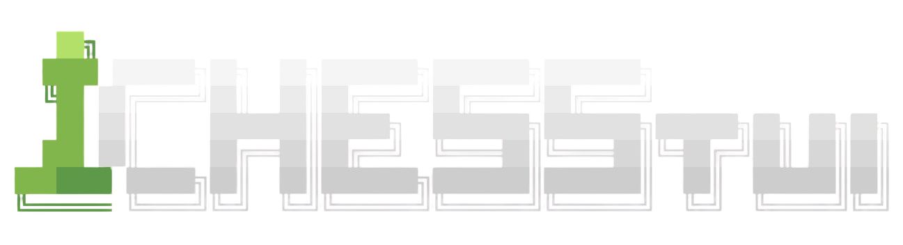
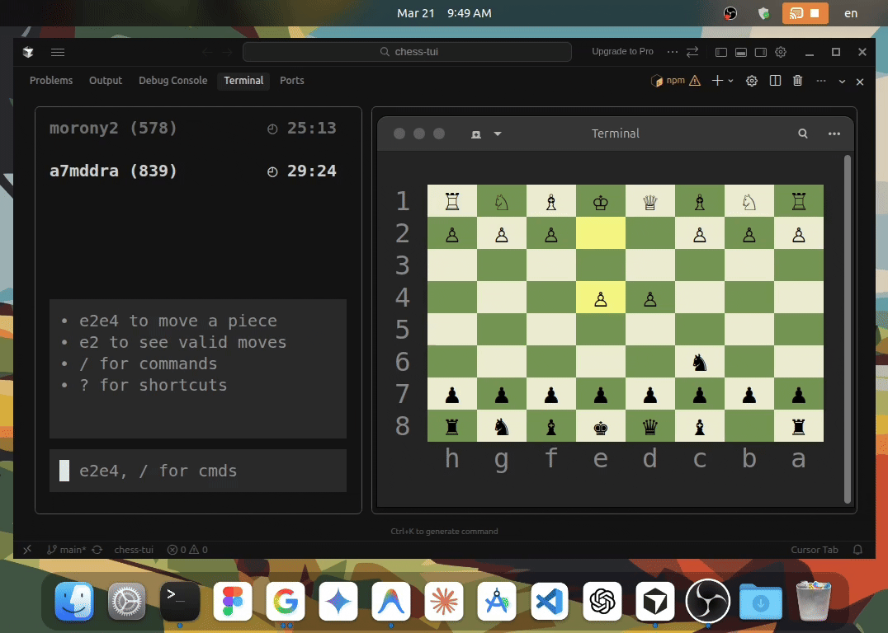

<p align="center">
  
  
</p>

<p align="center">Play chess.com from your terminal. Your real account, your real Elo, ad-free.</p>

<p align="center">
  <a href="https://www.npmjs.com/package/chess-tui"></a>
  <a href="https://github.com/a7mddra/chess-tui/actions/workflows/release-ext.yml"></a>
</p>

## How it works

```
chess.com tab  ←→  Chrome extension  ←→  WebSocket  ←→  Terminal UI (Ink/React)
```

Chess.com exposes `board.move()` in the page's JavaScript scope. Our extension uses this to inject moves and scrape game state (FEN, clocks, player info) from the DOM. The TUI renders everything in the terminal and sends moves back through the same pipeline while the tab is minimized.

## Quick Start

**Prerequisites:**

- Ensure you have [Node.js and npm](https://nodejs.org/) installed on your machine.
- Ensure you have the [Chrome](https://www.google.com/chrome/) browser installed. (More browsers coming soon.)
- Ensure you have a [chess.com](https://chess.com) account.

### 1. Install the CLI

Install the package globally:

```bash
npm install -g chess-tui
```

### 2. Install the Bridge Extension

To connect to your real chess.com games, you need the companion Chrome extension:

1. Download `chess-tui-extension.zip` from **[GitHub Releases](https://github.com/a7mddra/chess-tui/releases/download/v0.1.0/chess-tui-extension.zip)**.
2. Extract the zip file.
3. Open [`chrome://extensions`](chrome://extensions) in your browser.
4. Enable **"Developer mode"** (toggle in the top right).
5. Click **"Load unpacked"** and select the extracted folder.
   _(Note: If Chrome shows any errors on the extension card, you can safely ignore them.)_

### 3. Play!

1. Open [chess.com](https://chess.com) in Chrome and start or resume a game.
2. Open your terminal **anywhere** and run:

```bash
chess-tui
# or simply:
chess
```

Enjoy playing ad-free right from your terminal!

### 4. Troubleshooting

Most issues come from the connection between Chrome and the terminal. The best way to fix them is to reload the Chrome tab and restart the TUI until they reconnect.

## Game Modes

### Online (chess.com)

Connect to your chess.com session through the extension. Play live games with real opponents, see clocks, Elo, draw offers, and captured pieces — all in the terminal.

### Offline (Stockfish)

Play against the Stockfish engine locally. Adjustable Elo from 100 to 3000. No browser or internet needed.

## Features

- **Live board rendering** with 4 color themes
- **Premove system** with speculative move hints
- **Detachable board window** — pop the board into a separate terminal and zoom independently
- **Slash commands** — `/theme`, `/new`, `/resign`, `/draw`, `/accept`, `/decline`, `/analyze`, `/flip`, `/diff`, `/undo`
- **User preferences** persisted to `~/.config/chess-tui/`

## Documentation

- [Architecture](docs/architecture.md) — how the system works (start here for contributing)
- [Extension](docs/extension.md) — Chrome extension internals
- [Bridge Protocol](docs/bridge-protocol.md) — WebSocket message contract
- [Testing](docs/testing.md) — test lifecycle and fixture handling
- [Contributing](docs/contributing.md) — setup, conventions, and where to add code
- [Roadmap](docs/roadmap.md) — what's done and what's next
- [Security](SECURITY.md) — data boundary and fair-play policy

## Development

```bash
git clone https://github.com/a7mddra/chess-tui.git
cd chess-tui
npm install

npm run dev:tui      # Run the TUI
npm run build:ext    # Build the extension
npm run tsc:tui      # Type-check TUI
npm run tsc:ext      # Type-check extension
```

## Security & Fair Play

chess-tui does not endorse cheating. The extension injects moves the same way a human mouse click does — it calls the same `board.move()` function. However, connecting external engines to live games violates chess.com's terms of service. See [SECURITY.md](SECURITY.md) for the full policy.

## License

MIT License. See [LICENSE](LICENSE).

**Disclaimer:** `chess-tui` is an independently developed, unofficial open-source project. It is **not** affiliated with, endorsed by, sponsored by, or otherwise associated with Chess.com. All trademarks, service marks, and company names are the property of their respective owners. By using this software, you agree to abide by the Terms of Service and Fair Play guidelines of the corresponding platforms.
